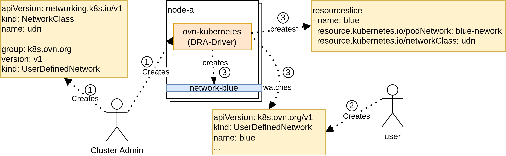
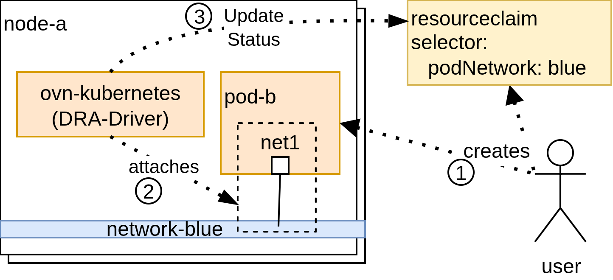

# NetworkClass

## Motivation

Kubernetes assumes a single, implicit pod network. As multi-network use cases become more common (secondary networks, tenant isolation, SR-IOV, storage networks, data-plane separation), Kubernetes lacks a standard mechanism to identify and integrate multiple pod networks with core APIs such as Pods, Services, and NetworkPolicy.

Currently, these "secondary" networks are defined by implementation-specific CRDs (e.g., OVN-Kubernetes with `UserDefinedNetwork`). Because there is no standard Kubernetes-owned "pointer" to these objects, the rest of the ecosystem remains blind to them.

This proposal introduces `NetworkClass`, a Kubernetes-owned API that classifies implementation-defined network objects without standardizing their internal semantics and offers an attachment model for pod networks.

Goals:
* Provide a stable, Kubernetes-native abstraction to identify pod networks.
* Leverage Dynamic Resource Allocation (DRA) to provide a consistent way for pods to attach to these networks via ResourceClaims.
* Enable multiple network implementations to coexist without schema convergence.
* Provide a common mechanism for secondary networks that the kubernetes ecosystem (Services, Network Policies...) could consume.

Non-Goals:
* Standardizing / Definition of an implementation-specific networking model such as IP address management, topology or routing behavior.
* Imposing any non-kubernetes implementation specific underlying mechanism (e.g. CNI)

## proposal

`NetworkClass` defines a mapping between a Kubernetes-recognized network class and an implementation-specific network object type. It does not define networking behavior or semantics. Instead, it provides a classification and discovery mechanism that allows Kubernetes APIs and controllers to recognize and integrate multiple pod networks.

`NetworkClass` is a cluster-scoped resource. It is expected to be installed by the cluster administrator together with a pod network implementation.

A `NetworkClass` references a specific Group/Version/Kind (GVK). Any object matching this GVK is considered a network instance belonging to that `NetworkClass`. Users create implementation-defined network objects, while Kubernetes uses NetworkClass to recognize them as pod networks.

The presence of at least one `NetworkClass` object indicates that multi-network functionality is available in the cluster.

```go
// NetworkClass describes a class of pod networks implemented
// by a specific controller and represented by implementation-defined objects.
type NetworkClass struct {
	metav1.TypeMeta
	// Standard object's metadata.
	// More info: https://git.k8s.io/community/contributors/devel/sig-architecture/api-conventions.md#metadata
	// +optional
	metav1.ObjectMeta
	// spec is the desired state of the NetworkClass.
	// More info: https://git.k8s.io/community/contributors/devel/sig-architecture/api-conventions.md#spec-and-status
	// +optional
	Spec NetworkClassSpec
}

// NetworkClassSpec describes how network objects of this class are identified.
type NetworkClassSpec struct {
	// Group is the API group of the network object.
	Group string
	// Version is the API version of the network object.
	Version string
	// Kind is the Kind of the network object.
	Kind string
}
```

To integrate pod networks with Dynamic Resource Allocation (DRA), this proposal defines two new standard device attributes. These attributes allow `ResourceClaims` to select specific pod networks and allow the system to identify devices that attach workloads to a given network.

A device that attaches a workload to a network must report the associated ResourceClaim device status with a reference to the network. The relationship between a device and a network can be determined by matching the device identifier and its attributes in the corresponding ResourceSlice.

```golang
const (
	// StandardDeviceAttributePrefix is the prefix used for standard device attributes.
	StandardDeviceAttributePrefix = "resource.kubernetes.io/"

	// StandardDeviceAttributePodNetwork is a standard device attribute name
	// which describes a pod network.
	// The value is a string value referring to the name of an object from the GVK defined in the 
  // StandardDeviceAttributeNetworkClass attribute.
	StandardDeviceAttributePodNetwork resourceapi.QualifiedName = StandardDeviceAttributePrefix + "podNetwork"
	// StandardDeviceAttributePodNetworkNamespace is a standard device attribute name
	// which describes the namespace of a pod network.
	// The value is a string value referring to the namespace of a pod network object.
  // The attribute is optional for the NetworkClass pointing to a non-namespaced GVK.
  // The attribute is mandatory for the NetworkClass pointing to a namespaced GVK.
	StandardDeviceAttributePodNetworkNamespace resourceapi.QualifiedName = StandardDeviceAttributePrefix + "podNetworkNamespace"
	// StandardDeviceAttributeNetworkClass is a standard device attribute name
	// which describes a NetworkClass.
	// The value is a string value referring to an existing NetworkClass object.
	StandardDeviceAttributeNetworkClass resourceapi.QualifiedName = StandardDeviceAttributePrefix + "networkClass"
)
```

### Example

A cluster admin defines which types of pod networks are available in the cluster by creating one or more `NetworkClass` objects. Each `NetworkClass` maps to a specific implementation-defined network resource.

```yaml
apiVersion: multinetwork.networking.k8s.io/v1
kind: NetworkClass
metadata:
  name: ovn-kubernetes
spec:
  group: k8s.ovn.org
  version: v1
  kind: UserDefinedNetwork
---
apiVersion: resource.k8s.io/v1
kind: DeviceClass
metadata:
  name: ovn-kubernetes-udn
spec:
  selectors:
  - cel:
      expression: device.attributes["resource.kubernetes.io"].networkClass == "ovn-kubernetes"
```

A pod network is declaratively defined using an implementation-specific network object. The network implementation prepares the underlying networking resources and advertises the availability of the network via the Resource API using a ResourceSlice.

```yaml
apiVersion: k8s.ovn.org/v1
kind: UserDefinedNetwork
metadata:
  name: blue-network
spec: 
  ...
---
apiVersion: resource.k8s.io/v1
kind: ResourceSlice
metadata:
  name: kind-worker-ovn-kubernetes
spec:
  devices:
  - attributes:
      resource.kubernetes.io/podNetwork:
        string: blue-network
      resource.kubernetes.io/networkClass:
        string: ovn-kubernetes
    name: blue-network-resource
  driver: ovn-kubernetes
  nodeName: kind-worker
  pool:
    name: kind-worker
```

A workload requests attachment to a pod network by creating a ResourceClaim. The claim selects a network by matching the standard device attributes exposed in the ResourceSlice.

```yaml
apiVersion: resource.k8s.io/v1
kind: ResourceClaim
metadata:
  name: blue-network-attachment
spec:
  devices:
    requests:
    - name: blue-network
      exactly:
        deviceClassName: ovn-kubernetes-udn
        selectors:
          - cel:
              expression: device.attributes["resource.kubernetes.io"].podNetwork == "blue-network"
```

Once the workload is attached to the network, the network implementation reports the attachment details in the ResourceClaim device status. This includes implementation-specific connection data such as interface name, hardware address, and assigned IPs.

```yaml
apiVersion: resource.k8s.io/v1
kind: ResourceClaim
metadata:
  name: blue-network-attachment
spec:
...
status:
...
  devices:
  - device: blue-network-resource
    driver: ovn-kubernetes
    networkData:
      hardwareAddress: 5a:9f:d8:84:fb:51
      interfaceName: net1
      ips:
      - 10.10.1.2/24
    pool: kind-worker
```

**Note:** The selection of the `PodNetwork` and the `NetworkClass` can be done in the ResourceClaim but also in the DeviceClass.

Here is a diagram below representing the cluster preparation and the creation of a pod network:



1. A cluster administrator deploys a pod network implementation together with a `NetworkClass` that points to the Group/Version/Kind of the implementation network resource.
2. A user (determined by the implementation itself) creates a pod network using the implementation-defined network object.
3. The pod network implementation provisions the underlying network and advertises its availability using a ResourceSlice.

Here is a diagram below representing the pod creation and its attachment to a pod network:



1. A user creates a Pod and an associated ResourceClaim requesting the attachment to a pod network.
2. The pod network implementation attaches the Pod to the requested network.
3. The pod network implementation reports the attachment status to the ResourceClaim device status.

#### Identification of a network

Via the DRA feature in Kubernetes, an allocated device is reported in the ResourceClaim Status and identified by its set of device name, pool name and driver name ([MakeDeviceID(driver, pool, device string)](https://github.com/kubernetes/kubernetes/blob/v1.35.0/staging/src/k8s.io/dynamic-resource-allocation/structured/schedulerapi/types.go#L37)). The devices are allocated from the ResourceSlices based on the request and constraints in the ResourceClaim spec. An allocated device and its attributes can then be retrieved in the ResourceSlices via its identifier (device name, pool name and driver name). Thus, the pod network and networkClass can be retrieved in the attributes of the device in the ResourceSlice.

Here is an example below:
```yaml
apiVersion: resource.k8s.io/v1
kind: ResourceClaim
metadata:
  name: blue-network-attachment
spec:
...
status:
...
  allocation:
    devices:
      results:
      - device: blue-network-resource
        driver: ovn-kubernetes
        pool: kind-worker
        request: blue-network
```

The identifier of the allocated device is:
* Device Name: blue-network-resource
* Pool Name: kind-worker
* Driver Name: ovn-kubernetes

The device can be retrieved in the ResourceSlice:

```yaml
apiVersion: resource.k8s.io/v1
kind: ResourceSlice
metadata:
  name: kind-worker-ovn-kubernetes
spec:
  devices:
  - attributes:
      resource.kubernetes.io/podNetwork:
        string: blue-network
      resource.kubernetes.io/networkClass:
        string: ovn-kubernetes
    name: blue-network-resource # Device Name
  driver: ovn-kubernetes # Driver Name
  nodeName: kind-worker
  pool:
    name: kind-worker # Pool Name
```

The attributes of the corresponding device are stating the pod network and NetworkClass.

As a potential evolution that could simplify this architecture, the pod network and NetworkClass could be directly specified in the device status in the ResourceClaim. This could be done via 3 different way:
1. A new field in the network field of the device status of the ResourceClaim.
2. A new API provided by multi-network that will be required to be used in the generic `Data` field of the device status of the ResourceClaim.
3. DRA reporting the attributes of the allocated device directly in the ResourceClaim status.
This evolution could help to solve some remaining questions such as, what happens if a device representing a network is being removed while a ResourceClaim is using it? Or, what happens if the attributes change while a ResourceClaim is using it?

### Implementation

#### Conformance Tests

Conformance tests validate that a multi-network implementation correctly integrates with `NetworkClass` and the Kubernetes Resource API. These tests ensure that pod networks are discoverable, selectable, and observable using standard Kubernetes mechanisms.

Conformance tests validate:
* ResourceSlice Advertisement: A multi-network implementation must advertise each pod network instance using a ResourceSlice.
   1. For every network object matching the Group/Version/Kind referenced by a NetworkClass, at least one ResourceSlice is created.
   2. Each advertised device includes the following attributes:
      * `resource.kubernetes.io/podNetwork`, identifying the network instance.
      * `resource.kubernetes.io/networkClass`, identifying the corresponding NetworkClass.
   3. The advertised attributes accurately reflect the network object name and class.
* ResourceClaim Network Selection: A multi-network implementation must support attaching a Pod to a pod network via ResourceClaim selection using standard device attributes.
   1. A ResourceClaim selecting a pod network via the `resource.kubernetes.io/podNetwork` and the `resource.kubernetes.io/networkClass` attributes can be successfully allocated.
   2. The allocation results in a device being bound to the ResourceClaim.
   3. The selected device corresponds to a network advertised via a ResourceSlice.
* ResourceClaim Network Status Reporting: A multi-network implementation must report network attachment status through the ResourceClaim device status.
   1. For a Pod successfully attached to a pod network, the ResourceClaim status includes a device entry.
   2. The reported device can be unambiguously matched to a device advertised in a ResourceSlice stating the actual PodNetwork and NetworkClass.
   3. The reported status includes sufficient information to identify the network attachment, such as:
      * Network interface name
      * Hardware address (if applicable)
      * Assigned IP addresses (if applicable)

### Conceptual Ecosystem Integration

The following section is not a proposal to modify the Service Kubernetes APIs. It is a conceptual illustration only, intended to demonstrate how the `NetworkClass` abstraction proposed above could be integrated with other Kubernetes ecosystem APIs in the future. This section defines no requirements, no commitments, and no implied API changes.

Conceptually, Kubernetes APIs that need to operate on a specific pod network could reference a network using a (class, name) tuple. This allows APIs to identify a network without understanding its implementation details.

```golang
// Network identifies a specific pod network instance.
type Network struct {
	// Class identifies the NetworkClass responsible for the network.
	Class string

	// Name identifies the network object.
	Name string

	// Name identifies the namespace of the network object.
  // Optional if the network object is a non-namespace object.
	Namespace *string
}
```

The following example shows how a Kubernetes Service API could conceptually reference a pod network using `NetworkClass`. This is provided solely as an example to illustrate how `NetworkClass` enables ecosystem integration.

```golang
// Service describes what network traffic is allowed for a set of pods
type Service struct {
	metav1.TypeMeta

	// +optional
	metav1.ObjectMeta

	// spec represents the specification of the desired behavior for this Service.
	// +optional
	Spec ServiceSpec
}

// ServiceSpec provides the specification of a Service
type ServiceSpec struct {
	// Network selects the pod network this Service applies to.
	// If nil, the default pod network is used.
	// +optional
	Network *Network

	...
}
```

Example Service Definition (Conceptual):

```yaml
apiVersion: v1
kind: Service
metadata:
  name: my-service
spec:
  network:
    class: ovn-kubernetes
    name: blue-network
  selector:
    app.kubernetes.io/name: MyApp
  ports:
  - protocol: TCP
    port: 80
    targetPort: 9376
```

## Alternatives

An alternative approach discussed previously was the introduction of a PodNetwork API representing a pod network instance directly.

In this model, PodNetwork would have been an object containing a small set of common, implementation-agnostic fields. Rather than embedding implementation-specific networking semantics, the PodNetwork object would reference a separate, implementation defined network object that described the actual network configuration.

Under this approach, creating a pod network would require users to create two resources:
* A PodNetwork object, used by Kubernetes APIs to identify and reference the network.
* An implementation-specific network object, reconciled by the network implementation.
